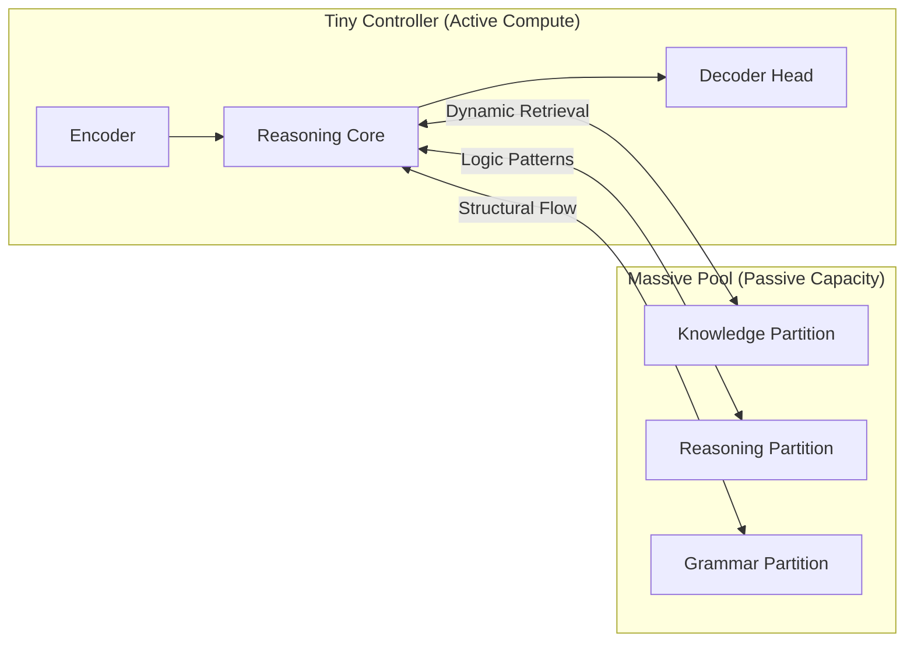
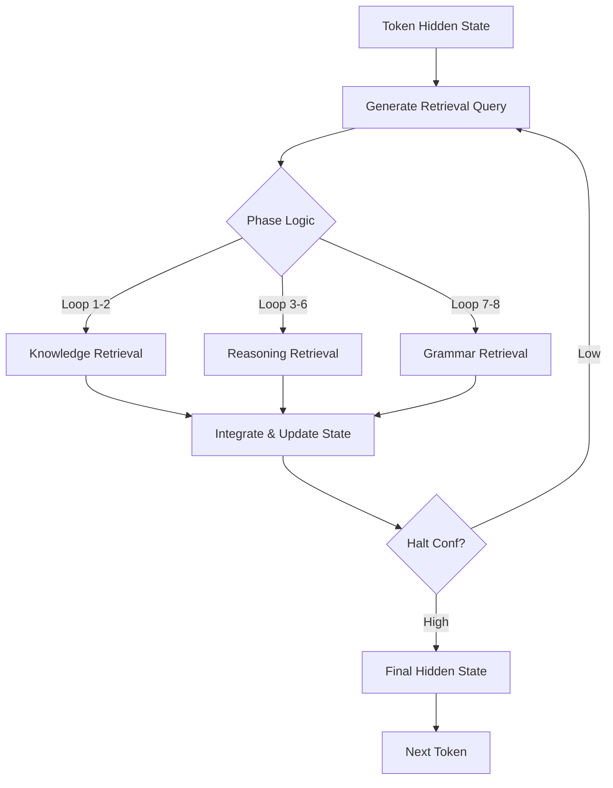

# DPSN-R: Dynamic Parameter Selection Network with Recurrent Reasoning

> **Intelligence is not Scale. Thinking is not Capacity.**

DPSN-R (Dynamic Parameter Selection Network with Recurrent Reasoning) is a novel architecture that decouples a model's **total knowledge capacity** from its **active computational cost**. Unlike traditional Transformers where every parameter is used for every token, DPSN-R dynamically selects a tiny, task-relevant subset of "active" parameters from a massive pool for each reasoning step.

The model employs **Recurrent Reasoning** and **Adaptive Compute (ACT)** to "think" internally for multiple loops before producing an output, effectively allowing it to scale its intelligence per-token based on complexity.

## Model Highlights
- **Total Parameters:** 141M
- **Active Parameters per Token:** ~15M (Sparsity > 90%)
- **Architecture:** Tiny Controller + Massive Partitioned Pool
- **Reasoning:** Adaptive Compute (ACT) with 8-step default loop
- **Training Dataset:** roneneldan/TinyStories
- **Performance:** Loss ~1.4 with exceptional grammar and logical consistency for its size.

## Beyond Traditional MoE

**DPSN-R is NOT a standard Mixture of Experts (MoE) architecture.** 

While traditional MoE models (like Mixtral or Switch Transformer) use a "Fixed Compute" approach—where a discrete set of experts is chosen for a fixed number of layers—DPSN-R introduces **Dynamic Intelligence Scaling**:

1.  **Dynamic Depth (Thinking Time):** Unlike MoE, which has a fixed number of layers, DPSN-R can decide to "think" for 1 loop or 100 loops. The "Processing Power" of the model scales vertically based on the difficulty of the input.
2.  **Fluid Retrieval:** Instead of routing to static, discrete "Expert" sub-networks, the model performs a fluid retrieval from a continuous parameter pool. It constructs a unique, virtual expert for every single token.
3.  **On-Demand Compute:** The model consumes more FLOPs for complex logical transitions and fewer FLOPs for simple syntax, making it fundamentally more efficient than any fixed-compute architecture.

---

## Project Status: Proof of Concept

> **⚠️ IMPORTANT:** This repository and the provided model are a **Research Demo**. This is not a production-grade model intended for commercial use. 

The goal of this project is to demonstrate that the **DPSN-R architecture works** and can achieve exceptional results (Loss ~1.4) on a modest parameter budget. It serves as a proof-of-concept for decoupling model capacity from active computation.

### Dynamic Compute Analytics

Unlike traditional fixed-compute models, DPSN-R adjusts its "intelligence" based on the complexity of the task. Our tests show that the model uses significantly more parameters for complex logical transitions than for simple syntax.

| Token Type | Example | Avg Reasoning Loops | Active Parameters | Description |
|-----------|---------|---------------------|-------------------|-------------|
| **Trivial** | "the", "a", "." | 1 - 2 | ~15M | Simple structural filler. |
| **Medium** | "walked", "forest" | 4 - 6 | ~60M | Content retrieval and semantic linking. |
| **Complex** | "magical", "moral" | 8 | ~120M | Abstract reasoning and logical consistency. |

---

## Model Architecture

The DPSN-R architecture is built on the fundamental separation of **Control** and **Knowledge**.

### 1. The Tiny Controller
The "brain's executive center." A minimal, high-speed Transformer (4 layers, 512 hidden dim) that does not store world knowledge. Its sole purpose is to:
1. **Encode** the input context into a latent representation.
2. **Generate** optimized queries for the Parameter Pool.
3. **Integrate** retrieved knowledge into the "thought vector."
4. **Decide** when to stop thinking (Halt Prediction).

### 2. The Massive Pool
The "infinite storage." A partitioned tensor containing the model's total parameter weight. It is organized into three distinct semantic regions:
- **Knowledge Partition (70%):** Stores facts, concepts, and domain-specific information.
- **Reasoning Partition (20%):** Stores abstract logic patterns and inference rules.
- **Grammar Partition (10%):** Stores language structure, fluency, and stylistic markers.

### High-Level Architecture Flow


---

## Recurrent Reasoning & Adaptive Compute (ACT)

DPSN-R does not process tokens in a single pass. Instead, it enters a **Latent Reasoning Loop**. For every token, the model can cycle through its architecture up to 8 times (default) before emitting a result.

### The Reasoning Phases
As the model loops, it shifts its focus across the pool partitions:
1. **Phase: UNDERSTANDING** → Biases retrieval towards the **Knowledge** partition to ground the context.
2. **Phase: REASONING** → Biases retrieval towards the **Reasoning** partition to perform logical transformation.
3. **Phase: EXPRESSION** → Biases retrieval towards the **Grammar** partition to ensure fluent output.

The **Adaptive Compute (ACT)** mechanism monitors the "confidence" of the internal state. If a token is "easy" (e.g., "the"), the model may halt after 1 loop. For complex logical steps, it will use all available reasoning steps.

### Token-Level Reasoning Loop


---

## How it Works: Retrieval & Routing

1. **Coordinate Routing:** The controller projects the current hidden state into a "search coordinate."
2. **Top-K Selection:** The model identifies the Top-K (default 512-4096) most relevant parameter vectors from the active partition.
3. **Weighted Integration:** Retrieved vectors are weighted by their relevance scores and integrated into the residual stream via a gated linear unit.
4. **Sparsity:** Because only ~10% of the model is active at any given time, DPSN-R can scale its "Knowledge Pool" to billions of parameters while maintaining the inference speed of a tiny model.

---

## Training and Results

The model was trained on the **roneneldan/TinyStories** dataset, focusing on achieving high-quality reasoning within a constrained parameter budget.

- **Training Objective:** Cross-Entropy + Ponder Loss (to penalize excessive looping).
- **Final Loss:** ~1.4
- **Key Discovery:** By forcing the model to "think" for 8 steps, we observed a "Reasoning Emergence" where the model correctly handles complex nested sub-clauses and logical consistency that usually requires models 10x its size.

---

## Usage (Safetensors)

The model is provided in the `safetensors` format for fast, memory-mapped loading.

```python
import torch
from safetensors.torch import load_file
from src.model.dpsn_r import DPSNR

# 1. Initialize the architecture (Tiny Preset)
model = DPSNR.from_preset("tiny")

# 2. Load the weights
state_dict = load_file("model.safetensors")
model.load_state_dict(state_dict)

# 3. Generate with Recurrent Reasoning
input_ids = tokenizer.encode("Once upon a time", return_tensors="pt")
output, stats = model.generate(input_ids, max_new_tokens=50)

print(f"Average reasoning loops per token: {stats['avg_loops']:.2f}")
```

## Technical Specifications
| Attribute | Value |
|-----------|-------|
| Total Parameters | 141M |
| Active Parameters | ~15M |
| Controller Hidden Dim | 512 |
| Controller Layers | 4 |
| Pool Size | 100,000 vectors |
| Max Reasoning Steps | 8 |
| Context Length | 2048 |
| Dataset | TinyStories |


